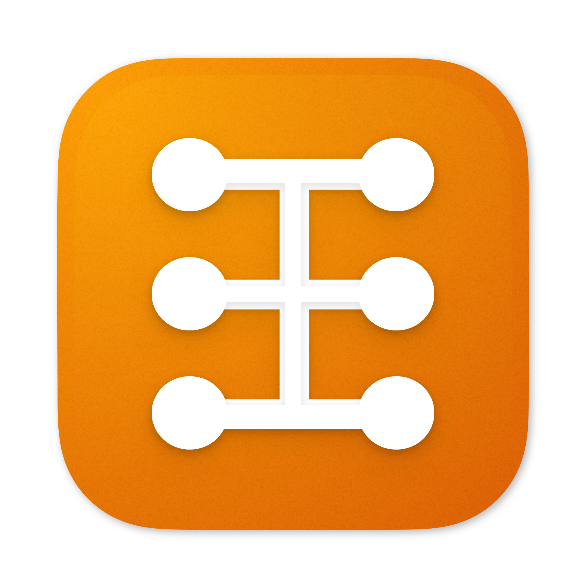

# Multi

Create a custom, lightweight macOS app from a group of websites, complete with:

 - Native notifications, file uploads, and dialogs
 - Ad-blocking, provided by [better.fyi](https://better.fyi)
 - Customization options with JSON, CSS, and JavaScript

Watch me create a Slack clone from scratch in 30 seconds (click the GIF for a higher resolution video):

<p align="center">
  <a href="https://kofi.sexy/slack-app-fewer-resources/demo.mp4" target="_blank">
    
  </a>
</p>


## Table of contents

 - [Installation](#installation)
 - [JSON configuration](#json-configuration)
 - [Using the CLI: `create-mac-app`](#using-the-cli-create-mac-app)
 - [Custom JS/CSS](#custom-jscss)
   - [Fix links in GMail and Google Calendar](#fix-links-in-gmail-and-google-calendar)
   - [Reload Slack when it disconnects](#reload-slack-when-it-disconnects)
   - [Find in page](#find-in-page)
   - [Drag-and-drop to open URLs](#drag-and-drop-to-open-urls)
   - [Preview link targets](#preview-link-targets)
 - [Keyboard shortcuts](#keyboard-shortcuts)
 - [Purchasing](#purchasing)

I've also written a few blog posts that discuss some of the ideas behind Multi:

 - Motivation: <https://kofi.sexy/blog/multi>
 - Performance: <https://kofi.sexy/blog/slack-app-fewer-resources>


## Installation

The easiest method is to use [Homebrew](https://brew.sh/):

```
brew install --cask multi
```

Alternatively, you can manually download and run the latest `.dmg` from [Releases](https://github.com/kofigumbs/multi/releases).
If you are on macOS 10.13 High Sierra (the minimum supported version), you'll also need to install [the Swift runtime from Apple](https://support.apple.com/kb/dl1998?locale=en_US).


## JSON configuration

Multi apps store their configuration in a single JSON file.
If your app is named `Test`, then you'll find that file at `/Applications/Multi/Test.app/Contents/Resources/config.json`.
The JSON configuration uses the following top-level fields:

| Field Name                   | Type                                              | Description                                                          |
|------------------------------|---------------------------------------------------|----------------------------------------------------------------------|
| `tabs`                       | Array (Required)                                  | Titles and URLs of tabs for this app                                 |
| `windowed`                   | Boolean (Optional, default `false`)               | Start the app with each tab in its own window                        |
| `alwaysNotify`               | Boolean (Optional, default `false`)               | Show macOS notifications even if your app is currently focused       |
| `openNewWindowsWith`         | String (Optional, macOS 10.15+)                   | Override system default browser for external links — value is a _bundle identifier_ like `com.apple.Safari`, `com.google.Chrome`, or `com.mozilla.firefox` |
| `openNewWindowsInBackground` | Boolean (Optional, default `false`, macOS 10.15+) | Determines if browser app becomes active when opening external links |

The `tabs` field is an array of objects with the following fields:

| Field Name          | Type                        | Description                                                            |
|---------------------|-----------------------------|------------------------------------------------------------------------|
| `title`             | String (Required)           | Whatever you want to call this tab                                     |
| `url`               | String (Required)           | Starting page for this tab                                             |
| `customJs`          | Array of Strings (Optional) | Custom JS URLs (see [Custom JS/CSS](#custom-jscss))                    |
| `customCss`         | Array of Strings (Optional) | Custom CSS URLs (see [Custom JS/CSS](#custom-jscss))                   |
| `basicAuthUser`     | String (Optional)           | User name credential for requests that use basic access authentication |
| `basicAuthPassword` | String (Optional)           | Password credential for requests that use basic access authentication  |
| `userAgent`         | String (Optional)           | Override the user agent header (Defaults to a recent Safari value)     |

Here's the bare minimum example used in the Slack demo video above:

```json
{ "tabs": [{ "title": "Slack Lite", "url": "https://app.slack.com/client" }] }
```

Here's a fancier example that uses the optional fields referenced above:

```json
{
  "tabs": [
    {
      "title": "Dancing",
      "url": "https://rc.kofi.sexy/bathroom-floss",
      "basicAuthUser": "user",
      "basicAuthPassword": "password",
      "userAgent": "Mozilla/5.0 (Macintosh; Intel Mac OS X 10_15_7) AppleWebKit/537.36 (KHTML, like Gecko) Chrome/87.0.4280.141 Safari/537.36"
    },
    {
      "title": "Walking",
      "url": "https://kofi.sexy/cel-shading",
      "customJs": [ "https://raw.githubusercontent.com/kofigumbs/multi/2.x/Assets/test.js" ],
      "customCss": [ "https://raw.githubusercontent.com/kofigumbs/multi/2.x/Assets/test.css" ]
    }
  ],
  "windowed": true,
  "alwaysNotify": true,
  "openNewWindowsWith": "com.apple.Safari",
  "openNewWindowsInBackground": true
}
```

If your configuration file fails to decode for any reason, your Multi app will open to the preferences window, where you can fix any issues.


## Using the CLI: `create-mac-app`

You can create and update Multi apps entirely from the command-line with the included script.
In fact, the Multi configuration UI just runs this script under-the-hood!
The `create-mac-app` script takes its options as environment variables.
For instance, here's how you'd create a bare-minimum app named `Test`:

```
MULTI_APP_NAME='Test' /Applications/Multi.app/Contents/Resources/create-mac-app
```

When you open `Test`, you'll be greeted with the preferences window, where you can finish configuring your app.
If you'd like to configure your app entirely from the command-line, you can set any of the following variables:

|                     |                                                                |
|---------------------|----------------------------------------------------------------|
| `MULTI_ICON_PATH`   | PNG or ICNS path to icon image                                 |
| `MULTI_JSON_CONFIG` | See [JSON configuration](#json-configuration)                  |
| `MULTI_OVERWRITE`   | Set to `1` to replace an existing Multi app with the same name |


## Custom JS/CSS

Multi lets you customize any site by injecting JavaScript and CSS on every page in your app.
Each custom JS/CSS file is specified with a URL, which gives you a few options for how you want to manage your customizations:

1. Host your file online, and use its URL: ex. `https://raw.githubusercontent.com/kofigumbs/dotfiles/master/example.js`
2. Reference a local file on your computer: ex. `file:///Users/kofi/workspace/dotfiles/example.js`
3. Encode your script directly in the JSON using [Data URIs](https://developer.mozilla.org/en-US/docs/Web/HTTP/Basics_of_HTTP/Data_URIs): ex. `data:,console.log%28%27Hello%2C%20from%20Multi%21%27%29%3B%0A`

Custom JS/CSS is one of the most important parts of Multi.
It lets the main project stay small and focused, while letting you extend it with new features that fit your use case.
If you have a neat JS/CSS snippet, you'd like to share, please open an Issue or Pull Request!
Here are a few that have come up before:

#### Fix links in GMail and Google Calendar

Google seems to be doing some trickery here.
Instead of allowing the browser to handle the <a target=_blank> links, they use JS to open a blank popup window, then dynamically set the URL to google.com/url?q=REAL_URL_HERE.
Presumably all of this is so that they can track you for a few moments on your way out of their app.
Custom JS solution:

```js
(() => {
  const listener = e => e.stopPropagation();
  const query = () => document.querySelectorAll('a[target=_blank]').forEach(a => {
    a.removeEventListener('click', listener);
    a.addEventListener('click', listener, true);
  });
  query();
  setInterval(query, 400); // wait time between DOM queries, in milliseconds
})();
```

#### Reload Slack when it disconnects

Sometimes Slack's WebSocket disconnects and stops loading new messages.
It seems like this is either an issue with [WebKit](https://bugs.webkit.org/show_bug.cgi?id=149551) or [Slack.com](https://slack.com/help/articles/205138367-Troubleshoot-connection-issues#websocket-trouble).
Custom JS solution:

```js
setInterval(() => {
  if (document.body.innerText.includes('Load new messages.'))
    window.location.reload();
}, 90000);
```

#### Find in page

Multi doesn't include any search functionality (Cmd-F).
Custom JS solution:

```js
(() => {
  const highlightResults = (text, color) => {
    document.designMode = "on"; // https://stackoverflow.com/a/5887719
    var selection = window.getSelection();
    selection.collapse(document.body, 0);
    while (window.find(text)) {
      document.execCommand("HiliteColor", false, color);
      selection.collapseToEnd();
    }
    document.designMode = "off";
  };

  let mostRecentSearchText = "";
  const search = text => {
    highlightResults(mostRecentSearchText, "transparent");
    highlightResults(text, "rgb(255 255 1 / 50%)");
    mostRecentSearchText = text;
  };

  const input = document.createElement("input");
  input.placeholder = "Search...";
  input.style.padding = "10px 15px";
  input.style.fontSize = "15px";
  input.style.borderRadius = "3px";
  input.style.border = "solid 1px lightgray";

  const form = document.createElement("form");
  form.style.display = "none";
  form.style.position = "fixed";
  form.style.top = "15px";
  form.style.right = "15px";
  form.style.zIndex = "2147483647"; // https://stackoverflow.com/a/856569
  form.addEventListener("submit", e => {
    e.preventDefault();
    search(input.value);
  });

  const close = document.createElement("a");
  close.innerText = "⨯";
  close.href = "javascript:void(0)";
  close.style.fontSize = "30px";
  close.style.padding = "15px";
  close.style.textDecoration = "none";
  close.addEventListener("click", e => {
    e.preventDefault();
    search("");
    form.style.display = "none";
  });

  form.appendChild(input);
  form.appendChild(close);
  document.body.appendChild(form);

  document.addEventListener("keydown", event => {
    if (event.metaKey && event.key === "f") {
      event.preventDefault();
      form.style.display = "block";
      input.focus();
    }
  });
})();
```

#### Drag-and-drop to open URLs

Sometimes you have a URL outside of Multi (maybe in an email), and you want to open it in Multi.
Custom JS solution:

```js
document.addEventListener("dragover", e => e.preventDefault());
```

#### Preview link targets

Multi doesn't include any hover-to-preview-link-target functionality.
Custom CSS solution:

```css
a:hover::after {
  content: attr(href);
  position: fixed;
  left: 4px;
  bottom: 4px;
  padding: 4px;
  font-size: 12px;
  font-family: -apple-system, BlinkMacSystemFont;
  font-weight: normal;
  color: black;
  background: ghostwhite;
  border: solid 1px black;
  border-radius: 1px;
}
```


## Keyboard shortcuts

Multi's shortcuts should basically match those of other macOS apps:

|       |                       |   |                |                     |
|-------|-----------------------|---|----------------|---------------------|
| `⌘X`  | Cut                   |   | `⌘[`           | Back                |
| `⌘C`  | Copy                  |   | `⌘]`           | Forward             |
| `⌘V`  | Paste                 |   | `⌘R`           | Reload This Page    |
| `⌘↑V` | Paste and Match Style |   | `⌘+`/`⌘-`/`⌘0` | Zoom in/out/default |
| `⌘A`  | Select All            |   | `^Tab`         | Select Next Tab     |
| `⌘M`  | Minimize              |   | `^↑Tab`        | Select Previous Tab |
| `⌘H`  | Hide                  |   | `⌘1` - `⌘9`    | Select Tab          |
| `⌘W`  | Close Tab             |   | `⌘L`           | Copy current URL    |
| `⌘Q`  | Quit                  |   | `⌘↑T`          | Toggle Tab Bar      |
|       |                       |   | `⌘↑\`          | Toggle Tab Overview |


## Purchasing

Multi is paid software, with an unlimited free trial.
One week after you first use Multi, you'll see a message asking you to [make a purchase](https://gumbs.llc/multi/).
This message appears as a normal Multi tab, so if you wish to "extend your trial", just close that tab and continue doing what you were doing.
Of course, if you enjoy using Multi, I'd really appreciate if you purchased it eventually.
