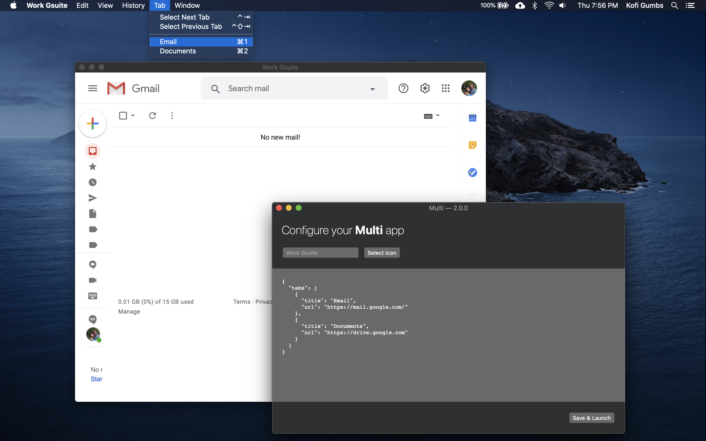

# Multi

Create a custom, lightweight macOS app from a group of websites.



 - Create apps from a UI or the command line
 - Configure settings with JSON
 - Built-in ad-blocker, provided by <https://better.fyi> (macOS 10.13+)
 - View one tab at a time or all at once with side-by-side view
 - Native bridges for Web APIs
     - `window.Notification`
     - `window.alert`
     - `window.prompt`
     - `<input type="file">`

## Installation

Download the latest `.dmg` file from the [releases](https://github.com/hkgumbs/multi/releases) page.
**Note:** Multi is not notarized, so you'll need to allow it to run via your "Security & Privacy" system preferences.
See [Licensing](#licensing) for more about sponsoring Multi's development.


## JSON configuration

Multi apps store their configuration in a single JSON file.
If your app is named `Test`, then you'll find that file at `/Applications/Test.app/Contents/Resources/config.json`.
The JSON should match this informal schema:

```js
{
  "tabs": [              // REQUIRED
    {
      "title": String,   // REQUIRED
      "url": String,     // REQUIRED
    }
    // include as many entries as you like in this array...
  ],
  "sideBySide": Boolean  // OPTIONAL, default false
}
```

If the configuration file fails to decode for any reason, your Multi app will open to the preferences window, where you can fix any issues.


## Using the CLI: `create-mac-app`

You can create and update Multi apps entirely from the command-line with the included script.
In fact, the Multi configuration UI just runs this script under-the-hood!
The `create-mac-app` script takes its options as environment variables.
For instance, here's how you'd create a bare-minimum app named `Test`:

```
MULTI_APP_NAME='Test' /Applications/Multi.app/Contents/Resources/create-mac-app
```

When you open `Test`, you'll be greeted with the preferences window, where you can finish configuring your app.
If you'd like to configure your app entirely from the command-line, you can set any of the following variables:

|                     |                                                                |
|---------------------|----------------------------------------------------------------|
| `MULTI_ICON_PATH`   | PNG path to icon image                                         |
| `MULTI_JSON_CONFIG` | See [JSON configuration](#json-configuration)                  |
| `MULTI_OVERWRITE`   | Set to `1` to replace an existing Multi app with the same name |


## Keyboard shortcuts

Multi's shortcuts should work equivalently to those in modern browsers.

|      |            |   |             |                     |
|------|------------|---|-------------|---------------------|
| `⌘X` | Cut        |   | `⌘0` - `⌘9` | Jump to tab         |
| `⌘C` | Copy       |   | `⌘R`        | Reload page         |
| `⌘V` | Paste      |   | `⌘[`        | Back                |
| `⌘A` | Select All |   | `⌘]`        | Forward             |
| `⌘Q` | Quit       |   | `^Tab`      | Select next tab     |
| `⌘H` | Hide       |   | `^↑Tab`     | Select previous tab |
| `⌘M` | Minimize   |   |


## Licensing

Multi is open source software (GPLv3), but it is also paid software.
One week after you install Multi, you'll see a message in your apps asking you to
[purchase a license](https://gumbs.llc/multi/).
Since Multi is open source, and since I've made no attempt to obfuscate the code, you _could_ remove the license check and recompile the project.
Please don't do that.
I'd like to continue improving Multi with new features and bug fixes, and license purchases enable me to do so.
